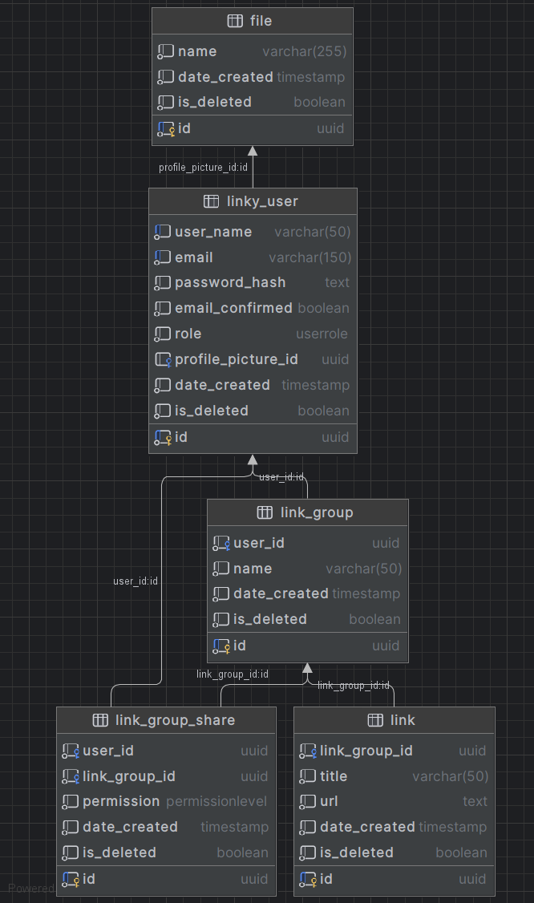

# Project Readme

## Project Name

**Project Name**: LinkyApp

## Project Description

Introducing LinkyApp: Your One-Stop Bookmark Solution

Ever wondered how to manage your bookmarks across multiple browsers? LinkyApp is the answer. It is a web application that allows you to store and manage your bookmarks in one, organized space.

The project's objective is to provide a deep understanding of fundamental concepts in full-stack web development, 
without the usage of frameworks.  

## Table of Contents

- [Project Description](#project-description)
- [Table of Contents](#table-of-contents)
- [Getting Started](#getting-started)
- [Installation](#installation)
- [Usage](#usage)
- [Features](#features)
- [LinkyRouting](#linkyrouting)
- [LinkyApp extention](#linkyapp-extention)
- [Technologies](#technologies)
- [Database diagram](#database-diagram)
- [Contributing](#contributing)
- [License](#license)

## Getting Started

Clone repository code and proceed to 
[Installation](#installation).

The latest version of the application is also available on a [testing website](https://srv24.mikr.us:20136).

SSL certificate is currently a self-signed one, so there will be browser alert about privacy. 

## Installation

Pre-requisites:
 - docker installed

App configuration can be found in [.env](.env) file (passwords, ports, ssl, etc.).

After initial configuration, run the following commands in the root directory of the project:

```docker compose up```

Or if you want to run it in the background:

```docker compose up -d```

## Usage

LinkyApp is a management system for web links. You can add and manage links, group them and collaborate with other 
users. All the project's features are listed in [Features](#features).

## Features

- User accounts
  - register
  - login
  - session
- Saving web links
  - add
  - edit
  - delete
- Grouping links
- Sharing link groups and collaborating with other users
- My account settings
  - change username
  - change password
  - more to come !

## LinkyRouting

Despite the framework-free approach, during the creation of LinkyApp, I stumbled upon several issues with automation of
development processes. One of them was adding routes for web API. That is how LinkyRouting was born, a simple 
routing framework, which facilitates adding endpoints to the application.

Example usages are visible in the code (controllers), however it will be documented and moved as a separate project in 
the future.

## LinkyApp Extention

Add links to LinkyApp in just one click - no need to switch between tabs.

Currently it can be added locally - "linkyapp_extention" folder.
Supported browsers: Google Chrome

## Technologies

- Frontend
  - HTML 5
  - CSS 3
  - vanilla Javascript
- Backend (API)
  - PHP 8
- Database
  - PostgreSQL
- Web server 
  - Nginx
- Containerization
  - Docker

## Database diagram



## Contributing

Yet to be determined.

## License

MIT License

Copyright (c) 2023 Dawid Laska

Permission is hereby granted, free of charge, to any person obtaining a copy
of this software and associated documentation files (the "Software"), to deal
in the Software without restriction, including without limitation the rights
to use, copy, modify, merge, publish, distribute, sublicense, and/or sell
copies of the Software, and to permit persons to whom the Software is
furnished to do so, subject to the following conditions:

The above copyright notice and this permission notice shall be included in all
copies or substantial portions of the Software.

THE SOFTWARE IS PROVIDED "AS IS", WITHOUT WARRANTY OF ANY KIND, EXPRESS OR
IMPLIED, INCLUDING BUT NOT LIMITED TO THE WARRANTIES OF MERCHANTABILITY,
FITNESS FOR A PARTICULAR PURPOSE AND NONINFRINGEMENT. IN NO EVENT SHALL THE
AUTHORS OR COPYRIGHT HOLDERS BE LIABLE FOR ANY CLAIM, DAMAGES OR OTHER
LIABILITY, WHETHER IN AN ACTION OF CONTRACT, TORT OR OTHERWISE, ARISING FROM,
OUT OF OR IN CONNECTION WITH THE SOFTWARE OR THE USE OR OTHER DEALINGS IN THE
SOFTWARE.


---

LinkyApp is maintained by Dawid Laska. You can reach me at dawidlaska888@gmail.com.
